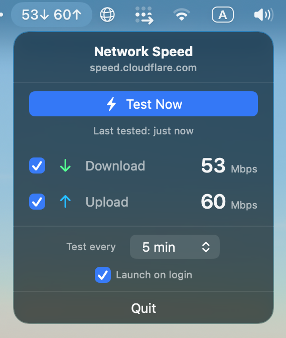

# Network Speed Menu Bar App

A lightweight macOS menu bar app that shows your internet speed at a glance, powered by [speed.cloudflare.com](https://speed.cloudflare.com).



## Why

If you're the kind of person who visits [fast.com](https://fast.com) multiple times a day — after restarting your router, joining a new WiFi network, or just because something feels slow — this app saves you the trip. Your download and upload speeds are always right there in the menu bar, updating automatically on a schedule you choose.

## Features

- **Real-time speed display** — Download and upload speeds update live in the menu bar as tests run
- **Cloudflare-powered** — Uses Cloudflare's speed test endpoints directly, no slow server discovery
- **Configurable display** — Choose whether to show download, upload, or both in the menu bar
- **Adjustable test interval** — Run speed tests every 5, 10, 15, 30, or 60 minutes
- **Launch on login** — Optional toggle to start automatically when you log in
- **Manual test** — Hit "Test Now" to run a speed test on demand
- **No dependencies** — Pure Swift/SwiftUI, no Python or CLI tools required

## Install

```bash
brew install m-tse/networkspeedmenubar/networkspeedmenubar
```

## Update

```bash
brew update && brew upgrade --cask networkspeed
```

## Requirements

- macOS 13.0 (Ventura) or later
- Apple Silicon (arm64)

## Build from source

```bash
git clone https://github.com/m-tse/NetworkSpeedMenuBarApp.git
cd NetworkSpeedMenuBarApp
chmod +x build.sh
./build.sh
open "Network Speed.app"
```

## How it works

The app downloads 25MB from `speed.cloudflare.com/__down` and uploads 10MB to `speed.cloudflare.com/__up`, measuring throughput in real time. Speeds are displayed in Mbps.
